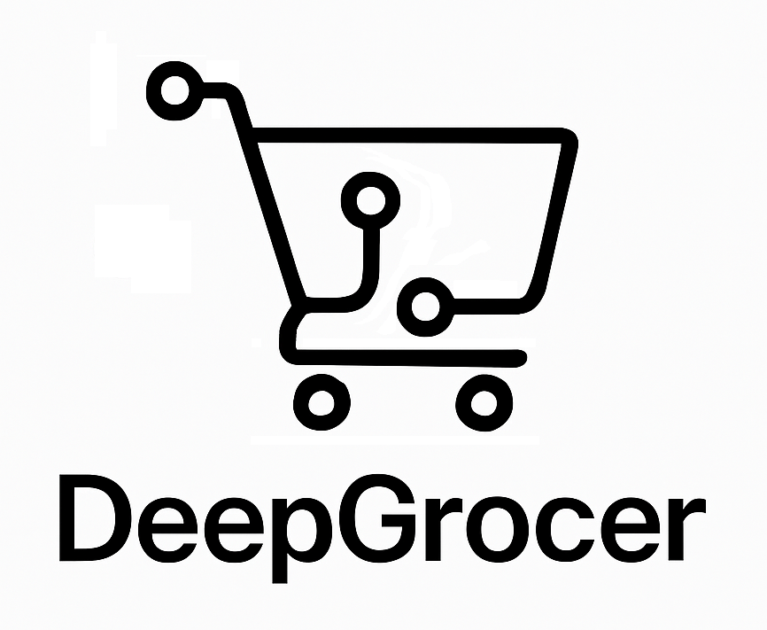

<p align="center">
  
</p>

<p align="center">
  
  
  
  
  
  
  
</p>

## In a nutshell

DeepGrocer is an agentic retail ops platform that senses store signals, forecasts demand, automates replenishment, optimizes planograms, labor, and pricing, orchestrates pick-pack, substitutions, last-mile, and checkout, manages recommendations, shrink, and energy programs, and writes signed, policy-backed receipts.

---

## What it is

DeepGrocer is a **control plane** for grocery operations. It connects cameras, POS, scales, IoT, e-commerce, and supply feeds, runs **agents** that decide and act in real time, and logs every change with **policy-as-code** receipts so autonomy can safely ramp over time.

---

## Use Cases

| Use case                                        | What it does                                                                                                           | Outcomes (typical)                                                                   |
| ----------------------------------------------- | ---------------------------------------------------------------------------------------------------------------------- | ------------------------------------------------------------------------------------ |
| **1) Store Floor Efficiency**                   | Detects OOS and facing gaps, assigns optimized restock tasks, forecasts queues and opens lanes, coaches self-checkout. | +1–2.5 pts on-shelf availability, −20–40% front-end wait, +8–12% labor productivity. |
| **2) Fresh and Supply Optimization**            | Sub-day demand sensing, MPC replenishment, dynamic markdowns, cold-chain guard, donation routing.                      | −15–30% perishables shrink, higher fill rates, faster time-to-shelf.                 |
| **3) E-commerce Pick, Substitution, Last-mile** | Batches pick paths, selects high-acceptance subs, routes deliveries across gig, BOPIS, white-glove.                    | −15–25% refunds, +10–20% UPH, −8–12% delivery cost per order.                        |
| **4) Governance, Safety, Profit Integrity**     | Price and promo guardrails, recall trace, vendor scorecards, energy optimization, signed audit receipts.               | Fewer compliance incidents, faster recall containment, −6–10% energy spend.          |

> Numbers are sanity-check ranges seen in mature autonomy programs. Validate with your pilots.

---

## User stories

1. **Store Manager:** *I want real-time tasks for stocking, markdowns, and queues so the team focuses on the next most valuable action, and I can prove every change with receipts.*
2. **Supply or Category Planner:** *I want sub-day forecasts and MPC orders that respect DC capacity and truck windows so I raise in-stock without blowing working capital.*
3. **E-commerce Ops Lead:** *I want optimal pick waves, high-acceptance substitutions, and SLA-aware delivery routing so I hit on-time targets at the lowest cost.*
4. **Finance and Compliance:** *I want every price, promo, markdown, chargeback, and refund to produce a signed, policy-backed receipt so we can scale autonomy with trust and pass audits quickly.*

---

## System flow (end to end)

```mermaid
flowchart LR
  subgraph Signals
    POS[POS and Payments]
    Cams[Cameras and Shelf Sensors]
    IoT[Scales and IoT Temp Energy]
    Ecom[E-commerce Orders and Sessions]
    Supply[ASNs DC Transport]
  end

  subgraph ControlPlane[DeepGrocer Control Plane]
    Policy[Policy as Code and Risk Tiers]
    FS[Feature and Memory Store]
    Orchestrator[Agent Orchestrator]
    Receipts[Signed Audit Receipts]
  end

  subgraph Agents
    ShelfVision[ShelfVision]
    TaskRouter[Task Router]
    QueueFlow[QueueFlow]
    Replen[MPC Replenisher]
    PricePulse[Price and Markdown]
    PickPack[Pick-Pack Coach]
    SubGen[Substitution Genius]
    Router[Last-Mile Router]
    ColdGuard[Cold-Chain Guard]
    Recall[Recall and Trace]
    Energy[Energy Optimizer]
    Vendor[Vendor Scorecards]
  end

  subgraph Actuators[Actuation Targets]
    Handhelds[Handheld Tasks]
    Labels[ESL Labels POS]
    WMS[WMS and TMS]
    Comms[Staff and Customer Comms]
  end

  Signals --> ControlPlane
  ControlPlane --> Agents
  Agents --> Policy
  Policy --> Agents
  Agents --> Actuators
  Agents --> Receipts
  Receipts --> FS
  FS --> Agents
```



**How to read it:** Signals stream into the **Control Plane**. The **Orchestrator** activates agents within policy and risk limits. Agents act on store systems and people, emit **receipts**, and learn from outcomes via the memory store.

---

## Agent catalog

| Agent                             | Purpose                                                              | Primary KPIs                         |
| --------------------------------- | -------------------------------------------------------------------- | ------------------------------------ |
| **ShelfVision**                   | Detect OOS, phantom inventory, facing gaps from cameras and sensors. | On-shelf percent, restock latency.   |
| **Task Router**                   | Bundle and sequence tasks with ideal pick paths, photo proof.        | Tasks per hour, travel time.         |
| **QueueFlow**                     | Forecast front-end congestion, open lanes, steer to SCO.             | Wait time, SCO interventions.        |
| **Self-Checkout Coach**           | Auto-resolve SCO exceptions, reduce attendant calls.                 | AHT, attendant touches.              |
| **Demand Sensing**                | Sub-day SKU-store forecasts from POS, weather, events.               | MAPE, OSA, waste.                    |
| **MPC Replenisher**               | Model-predictive ordering respecting DC, truck, backroom.            | Fill rate, stockouts, DOH.           |
| **Planogram Enforcer**            | Compare realogram vs plan, propose feasible swaps.                   | Compliance percent, sales lift.      |
| **Price Pulse**                   | Elasticity-aware price and markdown decisions with guardrails.       | Margin, promo ROI, sell-through.     |
| **Smart Markdown**                | Time-window markdowns for perishables to sell not spoil.             | Shrink percent, gross margin return. |
| **Cold-Chain Guard**              | Monitor temp IoT, predict spoilage, auto claims.                     | Temp excursions, food safety.        |
| **Pick-Pack Coach**               | Batch waves, shortest paths, tote staging.                           | UPH, cycle time.                     |
| **Substitution Genius**           | Choose subs using taste graph and accept history.                    | Refund rate, NPS.                    |
| **Last-Mile Router**              | Choose courier, gig, BOPIS, merge store with MFC.                    | On-time percent, cost per order.     |
| **Recall and Trace**              | Lot traceback, isolate, notify, refund.                              | Time to contain, closure rate.       |
| **Shrink Sentinel**               | Detect loss patterns, soft interventions.                            | Unknown shrink, incidents.           |
| **Energy Optimizer**              | Trim HVAC and lighting peaks within comfort.                         | kWh, peak demand.                    |
| **Vendor Scorecards**             | Audit on-time, fill, damage, draft chargebacks.                      | Recovery dollars, OTIF percent.      |
| **Member and Offer Personalizer** | Household offers, fuel optimization.                                 | Basket size, redemption, churn.      |
| **Service Copilot**               | Resolve tickets, refunds, credits under policy.                      | AHT, CSAT, leakage.                  |
| **Receipt Ledger**                | Sign every autonomous action with policy version and simulation.     | Audit pass rate, autonomy tier.      |

---

## Architecture (high level)

* **Ingest:** Kafka or Pub/Sub, S3 or ADLS, OpenTelemetry events
* **Compute:** Python and Typescript agents on a graph runtime with async workers
* **Models:** Vision, forecasting with exogenous features, routing and optimization, policy RL where applicable
* **Policy:** OPA style policy-as-code with risk tiers. Every action requires a pre-flight simulation and writes a **receipt** with hash, actor, inputs, policy version, and rollback metadata
* **Surfaces:** Store handheld app, Ops dashboard, Planner workspace, Receipts explorer

---

## Getting started (local dev)

```bash
# 1) clone
git clone https://github.com/<org>/deepgrocer.git
cd deepgrocer

# 2) run services (dev compose includes Kafka, Postgres, MinIO, UI)
make up

# 3) init DB tables
make db

# 4) optional: seed synthetic data
make seed

# 5) visit API and UI
open http://localhost:8000
open http://localhost:3000
```

**Config:** see `./config/policy/` for guardrails, `./config/routing/` for MIP or MPC parameters, and `./config/vision/` for detection thresholds.

---

## Cloud deployments

DeepGrocer ships with parity paths for **GCP Vertex AI** and **Azure ML + Azure OpenAI**. You can adopt one cloud or keep both for cross-cloud.

### GCP: Vertex AI

**What this enables**

* Vertex Pipelines for train, eval, register, deploy
* Model Registry and Endpoint canary or blue-green
* Feast on BigQuery for features and point-in-time correctness
* Matching Engine for vector search if enabled in RAG flows
* Cloud Build or Cloud Deploy for CI and promotion gates
* Cloud Monitoring dashboards and alerts for latency, error rate, drift, freshness

**Folders to check in**

```
infra/gcp/                  # Terraform for Vertex AI, Artifact Registry, BigQuery, Pub/Sub, Monitoring, IAM
pipelines/gcp/vertex/       # Pipeline DAG, components, compile and submit scripts
features/feast/gcp/         # Feast with BigQuery provider
services/inference/deploy/gcp/
observability/gcp/          # Monitoring policies, dashboards
governance/opa/             # Conftest gates for Cloud Build
```

**Deploy to Vertex AI**

```bash
# 0) project setup
gcloud config set project $PROJECT
gcloud services enable aiplatform.googleapis.com cloudbuild.googleapis.com run.googleapis.com \
  monitoring.googleapis.com artifactregistry.googleapis.com

# 1) infra
cd infra/gcp
terraform init
terraform apply -auto-approve

# 2) build and push containers
gcloud builds submit --config services/inference/deploy/gcp/cloudbuild.yaml .

# 3) create endpoint and canary split
python services/inference/deploy/gcp/deploy_endpoint.py \
  --project $PROJECT --region $REGION \
  --image us-central1-docker.pkg.dev/$PROJECT/deepgrocer/api:$(git rev-parse --short HEAD) \
  --traffic-split '{"stable":90,"canary":10}'

# 4) set SLOs and alerts
gcloud monitoring policies create --policy-from-file observability/gcp/monitoring_policies.json

# 5) run pipeline
python -m pipelines.gcp.vertex.run --project $PROJECT --region $REGION --bucket gs://$PROJECT-ml
```

**Screenshots to capture**
`/docs/screens/vertex-pipeline.png`, `/docs/screens/vertex-endpoint-traffic.png`, `/docs/screens/feast-materialization.png`, `/docs/screens/gcp-monitoring.png`

---

### Azure: ML and Azure OpenAI

**What this enables**

* Azure ML pipelines and registered models with online endpoints
* Azure OpenAI for LLM and RAG parity flows
* Synapse and Data Factory for data engineering paths
* App Insights and Azure Monitor for latency, error, drift, freshness
* ACR and AKS or ACI for containerized serving

**Folders to check in**

```
infra/azure/                # Bicep or Terraform for AML, AOAI, ACR, Key Vault, Synapse, ADF, Event Hubs, Monitor
pipelines/azure/aml/        # Pipeline components and submit scripts
features/feast/azure/       # Feast configured for Synapse or SQL
services/inference/deploy/azure/
observability/azure/        # App Insights workbook
governance/opa/             # Conftest or policy checks in CI
```

**Deploy to Azure**

```bash
# 1) provision
az group create -n $RG -l $LOC
cd infra/azure
az deployment group create -g $RG -f main.bicep -p baseName=deepgrocer

# 2) build and push
az acr build -r $ACR -t deepgrocer/api:$(git rev-parse --short HEAD) services/inference/app

# 3) create endpoint with blue or green strategy
python services/inference/deploy/azure/deploy_endpoint.py \
  --subscription $SUB --resource-group $RG --workspace $WS \
  --image "$ACR.azurecr.io/deepgrocer/api:$(git rev-parse --short HEAD)" \
  --strategy bluegreen

# 4) pipelines
python -m pipelines.azure.aml.run --subscription $SUB --resource-group $RG --workspace $WS

# 5) observability
az monitor app-insights component update -g $RG -n $AI --kind web
```

**Screenshots to capture**
`/docs/screens/azure-aml-pipeline.png`, `/docs/screens/azure-endpoint-bluegreen.png`, `/docs/screens/azure-appinsights.png`

---

## LLM, RAG, and Copilot

* **RAG services** with Vertex Matching Engine or Azure embeddings and vector stores
* **Guardrails** with policy-aware prompts, redaction, and structured outputs
* **Teams and Slack adapters** for store and care ops
* **Receipts** that attach LLM decisions to policy versions and inputs

Folders:

```
llm/rag/
copilot/teams/
copilot/slack/
```

---

## Governance and security

* **Policy-as-code** with OPA or Conftest in CI. Promotion to prod blocks if eval metrics regress or missing model cards
* **RBAC** maps for IAM on GCP and AAD on Azure
* **Secrets** in Secret Manager or Key Vault. No secrets in code
* **Receipts** are append-only and include inputs hash, policy version, and rollback notes

---

## Observability

* **Dashboards** for latency P50 and P95, error rate, throughput, feature freshness
* **Drift and skew** checks with alerts to on-call
* **Shadow traffic** and **rollback playbooks** documented in `/ops/`

---

## Evidence pack

* `/docs/screens/` screenshots listed above
* `/docs/runbooks/rollback.md` and `/docs/runbooks/drift.md`
* `/docs/architecture/diagram.png` cross-cloud view
* Short video tour is optional but helpful

---

## Roadmap

* [ ] Pilot bundle: ShelfVision, Task Router, Smart Markdown, QueueFlow
* [ ] E-commerce bundle: Pick-Pack Coach, Substitution Genius, Last-Mile Router
* [ ] Governance bundle: Price Pulse, Recall and Trace, Receipt Explorer
* [ ] Planner bundle: Demand Sensing, MPC Replenisher, Planogram Enforcer
* [ ] Vertex AI pipelines and canary endpoints in this repo
* [ ] Azure ML pipelines and blue or green endpoints in this repo

---

## License

TBD. Apache-2.0 suggested for code. Separate license for models if required.

---

## Credits

Designed with operators in mind. Built for measurable lifts and provable safety.
